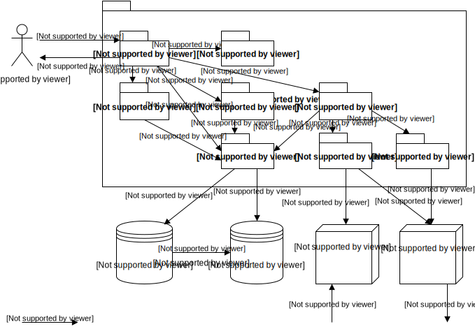

## Bausteinsicht

Folgende Schichten werden zur Strukturierung der einzelnen Klassen verwendet. Sie entsprechen grösstenteils den Verzeichnissen unter `/app`.

Die Pfeile geben die Abhängigkeitsrichtung an, beziehungsweise wer wen aufruft. Dabei sollen die Aufrufe immer nur in Pfeilrichtung gehen und nie entgegengesetzt. Weitere, nicht dargestellte Aufrufe zwischen Schichten sind nicht erlaubt. Ausnahmen sind im folgenden explizit erwähnt. Die Einschränkung gilt nicht für weitergereichte Objekte, wie beispielsweise Model Instanzen, welche vom Controller geladen und dann an die View gegeben werden.  

**Controller**: Verantwortlich für die Entgegennahme von Anfragen und die Bereitstellung von Antworten an Web Clients. Diese können sowohl natürliche Personen oder auch automatische REST Clients sein. Der Controller überprüft die Berechtigung mittels der Ability, lädt und ändert Daten via Domain und/oder Model und gibt danach die passende View zurück.

**View**: Übernimmt die Darstellung der vom Controller erhaltenen Daten. Views können für verschiedene Formate bestehen (HTML, JSON, ...). Sie sind entsprechend als Templates/`Views` oder als `Serializer` umgesetzt. Hilfsmodule/`Helper` und `Decorators` enthalten View-spezifische Logik.

**Ability**: Überprüft, ob der aktuelle Benutzer die Berechtigungen für die gewünschte Funktionalität hat. Dies ist abhängig von den an der Aktion beteiligten Models.

**Domain**: Domänenspezifische Funktionalität, welche über die Verantwortlichkeit eines Models hinausgeht. Übernimmt beispielsweise Operationen, welche mehrere Modelle betreffen. Import und Export als CSV und PDF ist ebenfalls hier umgesetzt.

**Model**: Stellt die Zugriffmöglichkeiten auf die Datenbank zur Verfügung. Eine Model Klasse verwaltet eine Datenbanktabelle gemäss dem Active Record Pattern. Alles was darüber hinausgeht, wird in Domain abgebildet. Spricht ebenfalls den Sphinx Service an.

**Job**: Übernimmt langlaufende Operationen in einem Hintergrundprozess. Wird normalerweise von einem Controller initiiert, kann jedoch in bestimmten Fällen auch von Domain Objekten gestartet werden.

**Mail Relay**: Realisiert die Mailing Listen. Ruft regelmässig E-Mails vom Pop3 Server ab und sendet diese via SMTP Server an die entsprechenden Empfänger weiter. Ist eigentlich Teil der Domain Schicht, wurde hier aufgrund der besonderen Rolle mit dem Pop3 Server jedoch als eigene Komponente dargestellt. Läuft innerhalb der Jobs.

**Mailer**: Erstellen und Senden Benachrichtigungs E-Mails via SMTP Server. Werden über die Jobs aufgerufen, können in bestimmten Fällen jedoch auch direkt von einem Controller oder einem Domain Objekt angesprochen werden.

**Datenbank**: Persistiert alle Daten der Applikation.

**Sphinx**: Enthält die Indizes für die Volltextsuche und beantwortet ensprechende Anfragen. Die Indizes werden periodisch aufgrund der Datenbank aktualisiert.

**Pop3 Server**: Empfängt die E-Mails für die Mailing Listen. Dies erfolgt über eine Catch-All Adresse einer definierten Domain.

**SMTP Server**: Sendet E-Mails an ihre Empfänger.
